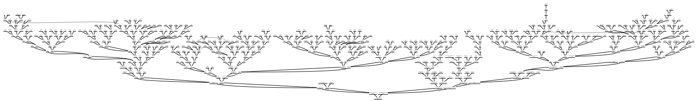

# Genesys

*A simple family tree generator that scales.*

## Features

It supports:
* GEDCOM to PDF conversion
* a single tree format, suitable large trees, that doesn't become a mess when the tree contains loops

Here's what it looks like for a large tree:

And looking closer:

## Usage

No package for now, you need to run the main fun in Main.kt. You should also have the `dot` command installed on your computer (this usually comes GraphViz).

As long as I'm the only person interested, I won't package
it. If anybody wants a package, create an issue, I'll do it, but for now, I'm the only user and I'm satisfied 🙂

## About

### Author

*Sébastien Guillemin*

### Motivation

I just couldn't find a free tool to create a tree without limitations in terms of number of generations, that still
looked decent for a large tree (500+ persons), and that handled family loops like I wanted.

Also, I was tired of
importing my GEDCOM file in every tool on the planet, when all I wanted was to create a PDF.

### Acknowlegments

Built with:
* [gedcom5-java](https://github.com/FamilySearch/gedcom5-java) parser, from [FamilySearch](https://github.com/FamilySearch/).
* [GraphViz](https://graphviz.org/) graph generator (not included)
