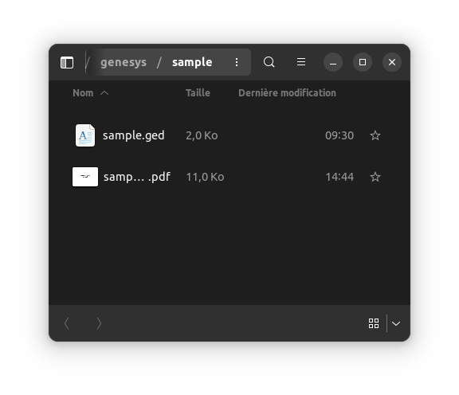

# Quickstart

Here are some step by step instructions to use Genesys.

## 1. Get your GEDCOM file

Genesys is **not** a genealogy creation / edition software. There are plenty of tools out there to do so (programs or
websites). But most of those tools allow you to **export your genealogy as a GEDCOM file**.

So do that!

## 2. Prerequisites

### Java

Install the Java Runtime Environment on your machine. The way to do that depends on the system you are using.

On Ubuntu, this can be achieved as follows:

```bash
sudo apt install default-jre
```

### GraphViz

Install GraphViz. To achieve that, you can follow the [instructions](https://graphviz.org/download/) on the GraphViz
website.

### Genesys

Get the latest version package which can be found here.

You can **download**:

* the `.tar` file if you are on Linux or MacOS
* the `.zip` file if you are on Windows

Then **extract** the files to the folder of your choice, referred to later in this document as `<genesys>`.

## 3. Running Genesys

### Launching the executable

The executable for Genesys are located in the `<genesys>/bin` folder.

* `genesys` is for Linux or MacOS
* `genesys.bat` is for windows

Run the Genesys executable corresponding to your system.

On Ubuntu or MacOS, this can be achieved in the terminal using these commands:

```bash
cd "<genesys>"
bin/genesys
```

### Selecting the GEDCOM file

A dialog should appear to select the GEDCOM file, do so and click "Open":


### Getting the result

The generated PDF file should have opened:


You can get it at the same location as your GEDCOM file, with a `.pdf` suffix:

